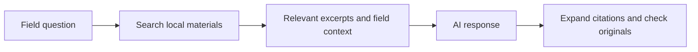

<div align="center">


# Ginger Companion

**One ginger field. A companion for every season.**

Keep an eye on the weather, record fieldwork, and work through growing questions together.

   

[Preview](#preview) · [Features](#features) · [Getting started](#getting-started) · [User guide](docs/USAGE.md) · [Paper library](docs/PAPER_LIBRARY.md)

</div>

---

Ginger Companion is a local web application for ginger growers. Record irrigation, fertilization, plant condition, and harvests; review daily reminders alongside weather forecasts; and optionally connect an AI service to discuss fieldwork with your records and relevant paper excerpts as context. The browser opens automatically when the application starts.

## Preview


<div align="center">

<sub>Demonstration-field screenshot · Location, planting date, area, and records are examples. The current application interface is in Chinese.</sub>

</div>

<details>
<summary><strong>View the narrow-screen layout</strong></summary>

<p align="center"></p>

The page adapts to narrow screens with bottom navigation. The current server accepts connections only from the same computer; preview this layout by narrowing a desktop browser window.

</details>

## Features

| Feature | Everyday use |
| :--- | :--- |
| **My field** | Set location, area, planting date, and harvest purpose; see the current growth stage and daily reminders |
| **Field journal** | Record plant condition, irrigation, fertilizer, treatments, soil tests, yield samples, and harvests; filter entries by type |
| **Weather updates** | Review temperature, precipitation, and forecasts, with timestamped cache status |
| **AI companion** | Connect a compatible text model to discuss questions using growing information and recent records |
| **Paper evidence** | Search imported local materials, expand citations, and open the original papers |
| **Reference estimates** | See a harvest window based on planting date and purpose; estimate yield when historical data or harvest samples are available |
| **Readability and backups** | Use larger text, supported device speech features, and field-record exports |

## Getting started

### 1. Get and launch the application

```bash
git clone https://github.com/kkkklck/ginger-companion.git
cd ginger-companion
```

Use **Python 3.10+**. The core application uses the standard library and **requires no additional Python packages**.

On Windows, double-click **`启动姜小伴.vbs`**, or run this command from the project directory:

```bash
python ginger_app.py
```

The browser normally opens `http://127.0.0.1:8765`. The application tries alternative ports if the default is occupied. The launcher's original filename is retained to match the supplied file.

### 2. Explore the demo, then create your field

1. Choose the demonstration-field option to explore the dashboard and journal without an AI key.
2. Add a fieldwork entry, such as plant condition or fertilization.
3. Choose the option to replace the demonstration field and confirm the change.
4. Enter location, area, planting date, and young-ginger or mature-ginger harvest purpose. Add other details later.

### 3. Connect AI when needed

In settings and help, enter your API key, Base URL, and an enabled text-model ID. Test the connection, then open the companion chat. Compatible services include Alibaba Cloud Model Studio; see the [User guide](docs/USAGE.md).

API keys are held only in memory for the current run and must be re-entered after shutdown. AI requests send relevant growing information, records, conversation context, and retrieved evidence to your configured service and may incur charges on your account.

## How paper evidence works



The public repository does not include the author's local papers or evidence packages. Once local materials are connected, retrieval results, citations, and source versions can be inspected. Automatically generated evidence cards still require checking against the original paper and its applicability. See the [Paper library guide](docs/PAPER_LIBRARY.md).

## Data and interpretation

| Item | Current behavior |
| :--- | :--- |
| Field data | Stored locally in `ginger_companion_data`; backup export is available in settings |
| Offline use | Fieldwork can still be recorded; weather updates and AI require internet access |
| Harvest window | A reference range based on planting date, harvest purpose, and optional local experience |
| Yield estimate | Uses historical yield or harvest samples; waits for local evidence when neither is available |
| Weather models | Regional forecasts and modeled soil values cannot replace measurements in your field |
| Application status | A local prototype, not yet trained or calibrated as a reliable agronomic prediction model |

Check local product labels and agricultural guidance for actual fertilizer or pesticide doses, mixtures, and intervals. Compare research conditions with your own field before applying published findings.

## Repository layout

```text
ginger-companion/
├── ginger_app.py              # Local server entry point
├── ginger_agronomy.py         # Reminders and reference estimates
├── ginger_services.py         # Weather, location, and AI services
├── ginger_store.py            # Local storage and paper library
├── ginger_ui/                 # Web interface and icons
├── 启动姜小伴.vbs             # Windows launcher
└── docs/                      # English guides, cover, and demo screenshots
```

[Release contents and optional paper capabilities](docs/RELEASE.md)

<details>
<summary><strong>Shutdown, backups, and troubleshooting</strong></summary>

Closing the browser tab may leave the server running. To exit completely, open settings and help, expand the data and help section, and select the application shutdown action.

Export a field backup in settings. For a complete backup, stop the application and copy the entire `ginger_companion_data` directory. Follow the page's messages and the [User guide](docs/USAGE.md) if connection, weather, or citation features are unavailable.

</details>

<div align="center">

<sub>Keep the daily notes. Care for the field.</sub>

</div>
