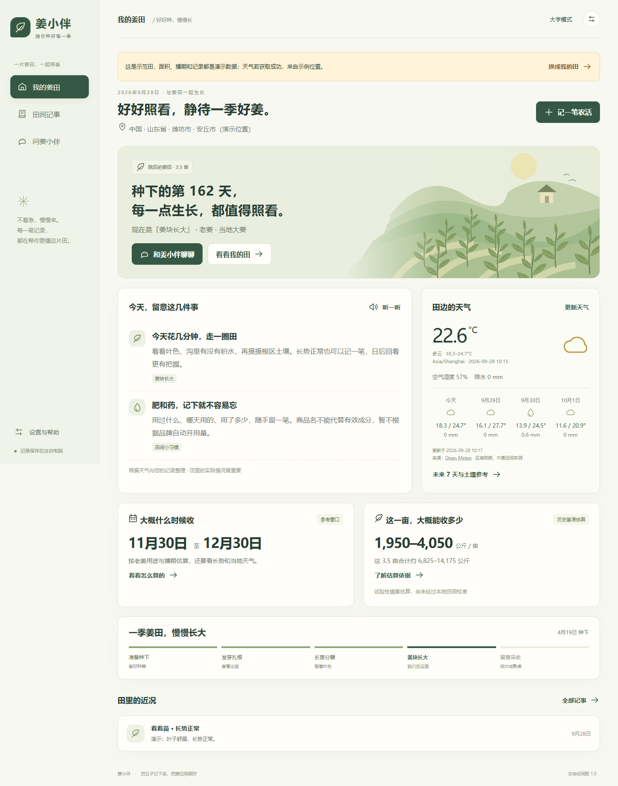
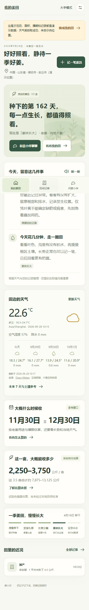

<div align="center">


# 姜小伴 · Ginger Companion

**一片姜田，一起照看。**

看看天气，随手记事，田里的问题一起想办法。

   

[界面预览](#界面预览) · [能帮你做什么](#能帮你做什么) · [开始使用](#开始使用) · [使用说明](姜小伴使用说明.md) · [论文资料](论文库测试指南.md)

</div>

---

姜小伴是面向生姜种植户的本地网页应用。记下浇水、施肥、长势与采收，结合天气查看每日提醒，也可以接入 AI，带着田间记录和相关论文资料商量农活。双击启动后自动打开浏览器，日常使用不需要命令行。

## 界面预览



<div align="center">

<sub>现有示范田截图 · 图中位置、播期、面积与记录用于演示。</sub>

</div>

<details>
<summary><strong>看看窄屏布局</strong></summary>

<p align="center"></p>

页面适配窄屏与底部导航；当前服务仅允许本机访问，可通过电脑浏览器窄屏预览。

</details>

## 能帮你做什么

| 功能 | 日常怎么用 |
| :--- | :--- |
| **我的姜田** | 填好位置、面积、播期与用途，查看当前阶段和今天的提醒 |
| **田间记事** | 记录长势、浇水、施肥、用药、测土、测产和采收，按类型回看 |
| **天气留意** | 查看气温、降雨与未来预报，保留带时间的缓存状态 |
| **问姜小伴** | 接入兼容文字对话模型，结合种植信息与近期记录讨论问题 |
| **论文依据** | 检索本地已导入资料，展开来源并查看原论文 |
| **参考估算** | 按播期与用途查看采收窗口；有本地历史亩产或采收样方时估算产量 |
| **易读与备份** | 大字模式、设备支持的语音功能，以及田间记录导出 |

## 开始使用

### 1. 获取并打开姜小伴

```bash
git clone https://github.com/kkkklck/ginger-companion.git
cd ginger-companion
```


准备 **Python 3.10+**，应用本身使用标准库，**无需安装额外 Python 包**。

Windows 可双击项目中的 **`启动姜小伴.vbs`**；也可以在项目目录运行：

```bash
python ginger_app.py
```

浏览器通常打开 `http://127.0.0.1:8765`。默认端口被占用时程序会尝试其他端口。

### 2. 先体验，再建自己的田

1. 点击 **“先逛逛示范田”**，无需 AI 密钥即可体验记事与首页。
2. 点击 **“记一笔农活”**，记下今天的长势或施肥情况。
3. 点击 **“换成我的田”**，确认后建立自己的姜田。
4. 填位置、面积、播种日期和嫩姜／老姜用途，其余信息可之后补充。

### 3. 按需接入 AI

在 **设置与帮助** 中填写 API Key、Base URL 和已开通的文字模型 ID，点击连接测试，再进入 **问姜小伴**。支持百炼等兼容接口，具体配置见 [使用说明](姜小伴使用说明.md)。

AI 密钥只保留在本次运行的内存中；退出程序后需重新填写。调用模型时，相关种植信息、记录、对话和检索资料会发送到你配置的服务，并可能产生账户费用。

## 论文资料怎么使用


公开仓库未附带作者本机的论文与证据包；接入本地资料后，论文库用于补充回答依据。检索命中、引用标注和原文版本可供检查；自动生成的候选证据卡仍需核读论文与适用条件。导入方式和资料状态说明见 [论文库测试指南](论文库测试指南.md)。

## 数据与使用边界

| 项目 | 当前行为 |
| :--- | :--- |
| 田间数据 | 保存在本机 `ginger_companion_data`，可在设置中导出备份 |
| 离线使用 | 可继续记录农活；天气更新与 AI 需要联网 |
| 采收窗口 | 基于播期、用途与可选的当地经验天数，提供参考范围 |
| 亩产估算 | 使用历史亩产或采收期样方；缺少本地依据时不显示虚构数字 |
| 天气模型 | 区域预报与土壤模型值，不能替代本田实测 |
| 应用状态 | 本地试用原型，尚未训练或校准为可靠的农学预测模型 |

化肥和农药的实际用量、混配与间隔应核对当地登记标签和农技指导。论文中的试验条件也需要与本田情况对照。

## 项目结构

```text
ginger/
├── ginger_app.py              # 本地服务入口
├── ginger_agronomy.py         # 农事提醒与参考估算
├── ginger_services.py         # 天气、定位与 AI 服务
├── ginger_store.py            # 本地存储与资料库
├── ginger_ui/                 # 网页界面与图标
├── 启动姜小伴.vbs             # Windows 双击启动
├── 姜小伴使用说明.md           # 完整使用说明
├── 论文库测试指南.md           # 本地论文资料说明
└── docs/assets/               # 主页封面与示范截图
```

[发布内容与可选论文能力说明](docs/RELEASE.md)

<details>
<summary><strong>怎样关闭、备份或排查问题？</strong></summary>

关闭浏览器页面后服务仍可能运行。彻底退出请使用 **设置与帮助 → 我的数据与使用帮助 → 退出姜小伴程序**。

可用设置中的导出功能保存田间备份；完整备份建议退出程序后复制整个 `ginger_companion_data` 文件夹。连接失败、天气不可用或论文无法引用时，请查看页面提示和 [使用说明](姜小伴使用说明.md)。

</details>

<div align="center">

<sub>把日子记下来，把姜田照顾好。</sub>

</div>
